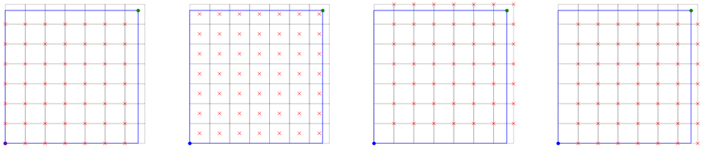
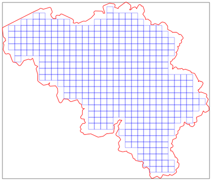
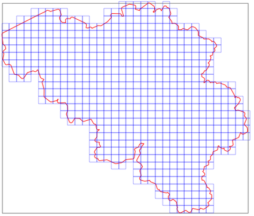
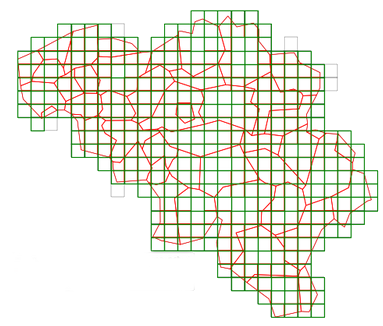
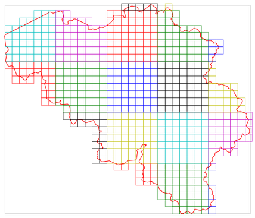
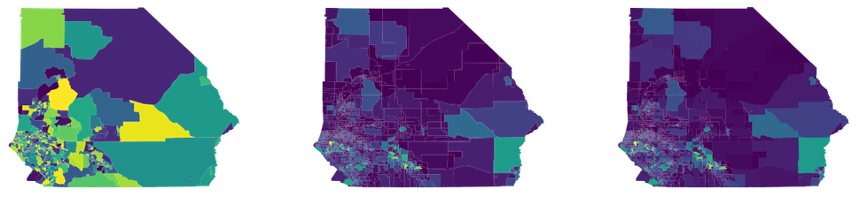

pygridmap
=========

Geoprocessing tools for efficient geometric mapping and set operations over geospatial grids.
---

The `pygridmap` package enable you to perform some basic geometric/set operations over vector datasets, including regular grid maker (_i.e._, rasterisation) and grid overlay (_i.e._ intersection and union). The code takes advantage of multiprocessor capabilities for efficient tile-based processing. 

**Description**

The package `pygridmap` supports the following methods/algorithms: 
* basic [**vector data handling**](https://saylordotorg.github.io/text_essentials-of-geographic-information-systems/s11-geospatial-analysis-i-vector-o.html) over geospatial grid (_e.g._, bounding box manipulations, locations definition, _etc_...) with the [`GridProcessor`](pygridmap/base.py) class,
<!-- -->
<table align="center"> 
        <header> <td align="centre">Regular gridding with different reference locations</td></header> 
        <tr> <td align="center" width="800px"> </img></td></tr> 
</table>

* user-defined [**rasterisation**](https://en.wikipedia.org/wiki/Rasterisation) of polygon regions (_e.g._, vector boundaries) into regular grids of various resolutions (_i.e._, dimension of one-size square grid cells) with the [`GridMaker`](pygridmap/gridding.py) class (see also `Java` implementation [GridMaker](https://github.com/eurostat/GridMaker)),
<!-- -->
<table align="center">
        <header> <td align="centre" colspan=2>Regular gridding striclty covering a spatial domain (left) or its interior only (right)</td></header> 
        <tr> <td align="center" width="300px"> </img></td>
        <td align="center" width="300px"> </img></td>
        </tr>
</table>

* customised [**vector overlay operations**](https://docs.qgis.org/3.10/en/docs/user_manual/processing_algs/qgis/vectoroverlay.html) (_e.g._, intersection, union, overlay/overlap and merging) between any polygon layer and a geospatial grid ("regular" or not) with the [`Gridoverlay`](pygridmap/overlay.py) class, including weighted areal interpolation.
<!-- -->
<table align="center">
        <header> <td align="centre">Intersection of a regular grid with an arbitrary vector layer</td></header> 
        <tr> <td align="center" width="320px"> </img></td></tr> 
</table>

**Quick install**

The `pygridmap` package can be installed using `pip`:
```python
>>> pip install pygridmap
```
If you wish to use the latest available version from _github_:
```python
>>> pip install git+https://github.com/eurostat/pygridmap.git
```

**Quick launch**

You can run (and update to your convenience) the test/example notebooks distributed with the `pygridmap` package in the [tests/](tests) folder, namely:
* [base.ipynb](https://nbviewer.jupyter.org/github/eurostat/pygridmap/blob/master/tests/base.ipynb) for basic data handling operations [](https://colab.research.google.com/github/eurostat/pygridmap/blob/master/tests/base.ipynb),
* [gridding.ipynb](https://nbviewer.jupyter.org/github/eurostat/pygridmap/blob/master/tests/gridding.ipynb) for regular grid making [](https://colab.research.google.com/github/eurostat/pygridmap/blob/master/tests/gridding.ipynb),
* [overlay.ipynb](https://nbviewer.jupyter.org/github/eurostat/pygridmap/blob/master/tests/overlay.ipynb) for overlay/overlap, merging, intersection and union operations [](https://colab.research.google.com/github/eurostat/pygridmap/blob/master/tests/overlay.ipynb).

**Usage**

*In your `Python` script*

The following classes are available: 
```python
>>> from pygridmap.base import FrameProcessor, GridProcessor
>>> from pygridmap.gridding import GridMaker
>>> from pygridmap.overlay import GridOverlay
```

*Through the `bash` command*

**Notes**

*Processing* 

The implementation of the methods above adopts (customised, using the [`multiprocessing`](https://docs.python.org/3/library/multiprocessing.html) module) multitprocessor tiling processing together with (native) vector processing whenever possible in order to take advantage of multiprocessor compute capabilities. Note  that the [`FrameProcessor`](pygridmap/base.py) class can be used to run embarassing parallel calculations on dataframe rows.
<!-- -->
<table align="center">
        <header> <td align="centre">Example of block-processing tiles</td></header> 
        <tr> <td align="center" width="320px"> </img></td> </tr> 
</table>

Geometric operations are making an extensive use of the geometric/geospatial `Python` module [`geopandas`](https://geopandas.org/) since this module supports essential features (most of them derived from the [`shapely`](https://shapely.readthedocs.io/en/latest/manual.html) [`fiona`](https://fiona.readthedocs.io/en/latest/manual.html) libraries), like:
  * basic [set](https://geopandas.org/set_operations.html) and [geometric](https://geopandas.org/geometric_manipulations.html) operations, and
  * [spatial indexing](https://geopandas.org/mergingdata.html?highlight=spatial%20index) through the [R-Tree algorithm](https://automating-gis-processes.github.io/site/notebooks/L3/spatial_index.html).
  
These implementations are probably not optimal since they are wrappers to the [`GEOS`](https://trac.osgeo.org/geos/) library, itself a port of the Java Topology Suite ([`JTS`](https://projects.eclipse.org/projects/locationtech.jts)), similarly to what is used in QGis.

*Algorithm*

On areal interpolation, the package `tobler` that is distributed with the [`pysal`](https://github.com/pysal) library enables to perform more generic operations (*i.e.*, not only considering grid as a target layer). Whenever one needs to  project/interpolate an extensive feature `attribute` from a `source` vector layer onto a `target` vector layer (*e.g.*, a regular grid), the following command:
```python
>>> from pygridmap import apps
>>> estimate = apps.area_interpolate(source, target, attribute) 
```
is equivalent to running:
```python
>>> from tobler import area_weighted
 >>> estimate = area_weighted.area_interpolate(source, target, extensive_variables = attribute)
```
<table align="center">
        <header> <td align="centre">Areal interpolation of an extensive variable (left) from coarse to fine using <a href="https://github.com/pysal/tobler/blob/master/notebooks/02_areal_interpolation_example.ipynb"><code>tobler</code> code</a> (left) and <code>pygridmap</code> algorithm (right)</td></header> 
        <tr> <td align="center" width="900px"> </img></td> </tr> 
</table>

With respect to the latter implementation, the current algorithm supports a tile-based multicore approach for the interpolation (through the setting of the `tile` parameter). The `tobler` algorithm will however help you "project" intensive variables as well.

**About**

<table align="center">
    <tr> <td align="left"><i>documentation</i></td> <td align="left"><b>in construction</b></td>  </tr> 
    <tr> <td align="left"><i>status</i></td> <td align="left">since 2020 &ndash; <b>ongoing</b></td></tr> 
    <tr> <td align="left"><i>contributors</i></td> 
    <td align="left" valign="middle">
<a href="https://github.com/gjacopo"></a>
</td> </tr> 
    <tr> <td align="left"><i>license</i></td> <td align="left"><a href="https://joinup.ec.europa.eu/sites/default/files/eupl1.1.-licence-en_0.pdfEUPL">EUPL</a> </td> </tr> 
</table>

**<a name="Requirements"></a>Requirements**

* Data handling: [`numpy`](https://numpy.org/) and [`pandas`](http://pandas.pydata.org).
* Geospatial data processing: [`geopandas`](http://geopandas.org), [`fiona`](https://fiona.readthedocs.io/en/latest/manual.html), [shapely](https://pypi.org/project/Shapely/), [`RTree`](https://toblerity.org/rtree/), [`geopy`](https://github.com/geopy/geopy) and [`pyproj`](https://github.com/pyproj4/pyproj).
* Map visualisations: [`ipyleaflet`](https://github.com/jupyter-widgets/ipyleaflet) or [`folium`](https://github.com/python-visualization/folium).

**<a name="Resources"></a>Other resources**

* Project [python-geospatial](https://github.com/giswqs/python-geospatial), a collection of `Python` packages for geospatial analysis, and earthdatascience, a repository of `Python` [tutorials](https://www.earthdatascience.org/tutorials/python/) and [workshop](https://www.earthdatascience.org/workshops/gis-open-source-python/).
* Library [`pysal`](https://github.com/pysal/pysal) for geospatial data science with an emphasis on geospatial vector data.
* Package [`tobler`](https://github.com/pysal/tobler) for an alternative implementation of areal interpolation (module [`area_weighted`](https://github.com/pysal/tobler/tree/master/tobler/area_weighted)), as well as dasymetric mapping, and change of support.
* Software [`GridMaker`](https://github.com/eurostat/GridMaker) for alternative grid maker. 

**<a name="References"></a>References**

* Gimond, M. (2019): [**Intro to GIS and Spatial Analysis**](https://mgimond.github.io/Spatial/index.html).
<!-- * Lovelace R., Nowosad J. and Muenchow J. (2019): [**Geocomputation with R**](https://geocompr.robinlovelace.net/), _Chapman & Hall/CRC_. -->
* de Smith M.J., Goodchild M.F. and Longley P.A. (2018): [**Geospatial Analysis: A Comprehensive Guide to Principles, Techniques and Software Tools**](https://www.spatialanalysisonline.com/HTML/index.html), _The Winchelsea Press_. 
* Garrard C. (2016): **Geoprocessing with Python**, _Manning Publications_.
* Westra E. (2016): [**Python Geospatial Development**](https://www.programmer-books.com/wp-content/uploads/2019/04/Python-Geospatial-Development-3rd-Edition.pdf), _PACKT Publishing_.
* Bahgat K. (2016): **Python Geospatial Development Essentials**, _PACKT Publishing_.
* Lawed J. (2015): [**QGIS Python Programming CookBook**](https://www.programmer-books.com/wp-content/uploads/2019/05/QGIS-Python-Programming-Cookbook.pdf), _PACKT Publishing_.
* Kresse W. and Danko D.M., eds. (2012): **Handbook of Geographic Information**, _Springer_, doi: [10.1007/978-3-540-72680-7](https://doi.org/10.1007/978-3-540-72680-7).
*  Campbell J. and Shin M. (2011): [**Essentials of Geographic Information Systems**](https://saylordotorg.github.io/text_essentials-of-geographic-information-systems/index.html) ([pdf](https://resources.saylor.org/wwwresources/archived/site/textbooks/Essentials%20of%20Geographic%20Information%20Systems.pdf)), _Saylor Academy Open Textbooks_.
